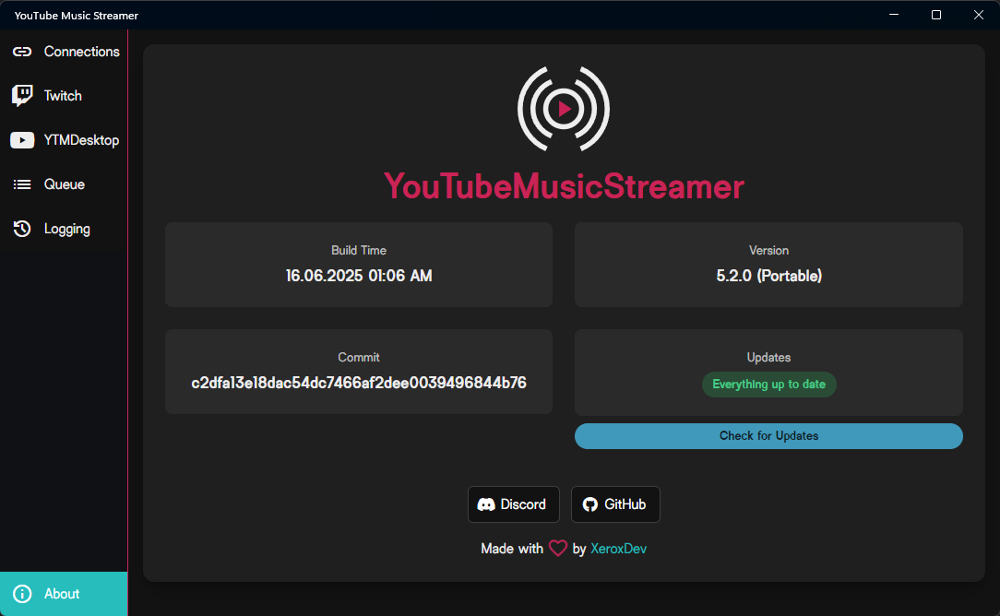

# YouTube Music Streamer

[![Discord][discord-badge]][discord-url]
[![Conventional Commits][conventional-commits-badge]][conventional-commits-url]
[![License][license-badge]][license-url]
[![Release][release-badge]][release-url]

<!-- [![Downloads][download-badge]][download-url] -->

## About
YouTube Music Streamer is a simple app, that allows you to combine [YouTube Music Desktop][ytmdesktop-url] with Twitch and your favourite Streaming Software.
From widgets to commands, everything is possible and the best part, customizable to your liking!

## Features
- **🤖 Autopilot Rewards**: Fully managed Twitch Channel Point rewards. The app automatically creates rewards, approves successful requests, and refunds points on failure.
- **🤖 Dedicated Bot Support**: Connect a separate Twitch account for chat responses to keep your broadcaster chat clean.
- **⚡ Zero-Restart Settings**: Change audio devices, log levels, or volume settings and see them apply instantly without restarting.
- **🗄️ Robust Persistence**: Powered by SQLite for industrial-grade reliability. Your queue and settings are always safe.
- **🚨 Health & Diagnostics**: A dedicated interface showing the live status of every connection and subsystem with one-click support reports.
- **🖼️ Independent Widgets**: Premade overlays that stay active even if YouTube Music is closed, showing a professional "Waiting for Music" state.
- **⌨️ Customizable Commands**: Control playback with your own prefixes, command names, and responses. Supports Bits and Channel Points.
- **🛡️ Precise Blacklist**: Prevent specific songs from playing on stream using exact Video ID matching.
- **📦 Installer & Portable**: Choose the distribution that fits your setup best.
- **Free & Open Source**: Genuinely free, open source (AGPL v3.0), and community-driven.

For even more information, images, and a detailed "Autopilot" change map, see [named_releases/v1.1-The-Autopilot-Update.md](named_releases/v1.1-The-Autopilot-Update.md) or visit the [official help desk][help-desk].

## Setup
To get started, you need to download the app from the [releases page][release-url]. Also, you need to have the [YouTube Music Desktop App][ytmdesktop-url] installed, as this app is just a companion app for it.
Lastly, you also need a Twitch Account and, of course, a streaming software.

> [!IMPORTANT]
> It's possible GitHub won't show all the files in the release, so make sure pressing the "Show all x assets" button to see all available files.

## Contributing
If you want to contribute to the project, feel free to open an issue or a pull request. You can also join the [Discord server][discord-url] to discuss features, report bugs, or just chat with other users.

For more information on how to contribute, check out the [Contributing Guide][contributing-guide].

## Code of Conduct
This project follows an adapted version of the Contributor Covenant. You can find the full text in the [CODE_OF_CONDUCT.md][code-of-conduct-url] file.
We expect all contributors to follow this code of conduct to ensure a welcoming and inclusive environment for everyone.

## License

This project is covered by the GNU AGPL v3.0. See [LICENSE][license-url].

Additional permissions and exceptions can be found in [ADDITIONAL-PERMISSIONS][additional-perm-url].

[help-desk]: https://help.xeroxdev.de/en/apps/youtube-music-streamer/
[discord-badge]: https://img.shields.io/badge/Discord-Join-C25?style=for-the-badge&logo=discord&logoColor=white&logoSize=auto&labelColor=222&link=https%3A%2F%2Fx.xeroxdev.de%2Fs%2Fdiscord
[discord-url]: https://x.xeroxdev.de/s/discord
[conventional-commits-badge]: https://img.shields.io/badge/Conventional%20Commits-1.0.0-%23FE5196?logo=conventionalcommits&logoColor=white&style=for-the-badge&labelColor=222
[conventional-commits-url]: https://conventionalcommits.org
[license-badge]: https://img.shields.io/github/license/XeroxDev/YouTubeMusicStreamer?style=for-the-badge&labelColor=222
[license-url]: LICENSE
[additional-perm-url]: ADDITIONAL-PERMISSIONS
[contributing-guide]: CONTRIBUTING.md
[code-of-conduct-url]: CODE_OF_CONDUCT.md
[release-badge]: https://img.shields.io/github/v/release/XeroxDev/YouTubeMusicStreamer?style=for-the-badge&labelColor=222
[release-url]: https://github.com/XeroxDev/YouTubeMusicStreamer/releases/latest
[download-badge]: https://img.shields.io/github/downloads/XeroxDev/YouTubeMusicStreamer/total?style=for-the-badge&labelColor=222
[download-url]: https://github.com/XeroxDev/YouTubeMusicStreamer/releases/latest
[ytmdesktop-url]: https://github.com/ytmdesktop/ytmdesktop